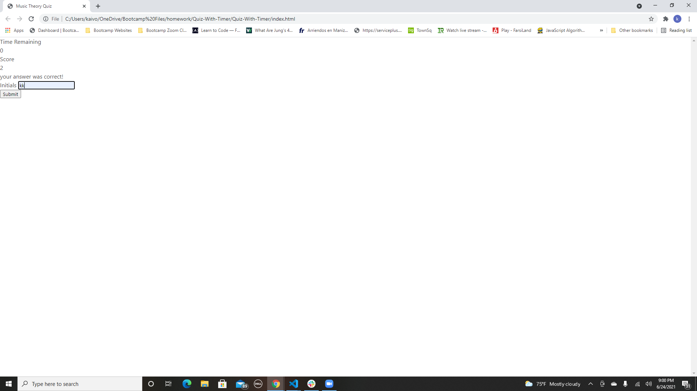

# <Quiz-With-Timer>

## Description
simple 5 question multiple choice quiz about the music theory

## Usage
Just open the page and press the 'Start Quiz' button to start the quiz and you will have 30 seconds to answer 5 questions with time decreasing when answering wrong. At the end put your initials in and press submit to save your score. If you like, refresh and try again to get a better score! :)

## Link to my github account: 

https://github.com/kaivont85/Quiz-With-Timer

## Screenshot of Deployed Website

  
  
  
  